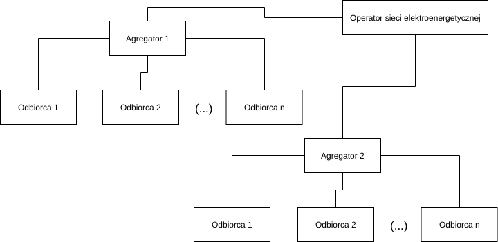

# Wykaz skrótów {-}

- MITM (ang. *man-in-the-middle*) - atak dokonywany przez podstawionego pośrednika.

# Definicje {-}

- odbiorca - gospodarstwo domowe lub przedsiębiorstwo pobierające energię elektryczną,
- agregator - podmiot gromadzący odbiorców celem zaoferowania operatorowi sieci przesyłowej zwiększonej stabilności,
- FMA (*Flexibility Measurement Architecture*) - architektura pomiaru elastyczności opisywana w niniejszej pracy, 
- użytkownik - odbiorca energii korzystający z implementacji proponowanej architektury do celów pomiaru własnej elastyczności,
- zamawiający - agregator użytkowników,
- scenariusz - określany przez zamawiającego zbiór warunków, jakie muszą zostać spełnione dla zaliczenia użytkownikowi próby elastyczności,
- DSR (*demand-side response*) - program angażowania strony popytowej w zapewnienie stabilności sieci elektroenergetycznej,
- elastyczność - zdolność odbiorcy do modyfikowania swego profilu zapotrzebowania na żądanie [@finck_quantifying_2018],
- indeks elastyczności - miara elastyczności oznaczana symbolem $FI$, obliczana przez uśrednienie wag wypełnionych przez użytkownika scenariuszy przy zastąpieniu wszystkich scenariuszy nie wypełnionych wartością $0$,
- pomiar elastyczności - proces wyznaczania indeksu elastyczności,
- próba elastyczności - składowa procesu pomiaru elastyczności odbiorcy,
- $FI$ - wartość spełniająca warunki: $FI = x \vert x \in {\rm I\!R^+} \land x \le 1$ [@junker_characterizing_2018],
- architektura korporacyjna - architektura opisująca przedsiębiorstwo jako system dla celów analizy lub wprowadzenia zmian; wbrew brzmieniu terminu nie rozumiemy pod nim jedynie "korporacji" w polskim znaczeniu tego słowa [@leks_pare_2010].

# Wstęp

W sierpniu 2015 roku polski rynek energii elektrycznej po raz pierwszy od 35 lat znalazł się w sytuacji wprowadzenia 20 stopnia zasilania [@dolega_national_2018]. Powodem były przedłużające się susze i związany z nimi niedobór wody niezbędnej do chłodzenia generatorów w elektrowniach.

Mechanizm stopni zasilania zaprojektowany został właśnie z myślą o takich sytuacjach. Pozwala on w sytuacji krytycznej unikąć tzw. *blackoutu* poprzez wprowadzenie czasowych limitów poboru energii dla podmiotów o zapotrzebowaniu powyżej 300 KW. Limity te są drastyczne i równe dla wszystkich największych odbiorców. Alternatywą dla wprowadzenia stopni zasilania pozostaje jedynie wyłączenie zasilania na całym obszarze, a nagły, gwałtowny wzrost zapotrzebowania na energię może wystąpić z dnia na dzień [@pap_pse_2015].

Sposobem na wykorzystanie siły wolnego rynku dla utrzymania zagrożonych dostaw energii jest program DSR. Według jego założeń, w sytuacji nagłego niedoboru energii niektóre podmioty dobrowolnie rezygnują z zaspokojenia części swego zapotrzebowania na rzecz pozostałych podmiotów. Wstrzymujący się od części konsumpcji otrzymują odpowiednie finansowe wynagrodzenie, a jego wymiar zależy od wielkości dostawy i jej zgodności z umową.

Jedną z podstawowych potrzeb programu DSR jest natomiast ocena wartości strategicznej poszczególnych odbiorców, którzy oceniani są według możliwości dostosowania własnego zapotrzebowania na energię do warunków panujących w Krajowej Sieci Elektroenergetycznej (KSE).

Przejście do modelu rynkowego, w którym odbiorca współuczestniczy w zapewnianiu stabilności dostaw energii dla wszystkich uczestników rynku, trwa od lat i jest wskazywane jako jedna z najbardziej korzystnych z bieżących perspektyw w dziedzinie energetyki [@ramchurn_putting_2012].

Pomimo dynamicznego rozwoju pokrewnej dziedziny planowania zużycia energii [@curtis_demand_2018], w kwestii szacowania elastyczności odbiorców otwarcie dotępne są przede wszystkim matematyczne modele problemu [@lund_review_2015]. Zaproponowanie architektury dla systemu implementującego taką funkcjonalność stanowi szansę na lepsze umocowanie publicznej dyskusji o praktycznym wyznaczaniu elastyczności konsumenckiej w warunkach rynkowych, a przez to również na rozwój w kierunku zoptymalizowania tego procesu [@kulkarni_perfect_2016].

## Dotychczasowe badania

Pytając o stosowane dotychczas metody pomiaru elastyczności energetycznej systemów napotykamy prace takie jak praca Lu [@lu_probabilistic_2018], zawierająca modele opisu urządzeń będących ważnymi częściami elastycznych systemów odbioru energii. Przykładowe modele - dla systemu składowania energii cieplnej oraz dla elektrycznego boilera, przedstawione zostały poniżej.

Matematyczny model systemu magazynowania ciepła:

$$a + b = c$$

Matematyczny model elektrycznego boilera:

$$2 + 2 = 5$$

## Problemy

Problemem istniejącym w tej dziedzinie jest wąska dostępność metod ewaluacji własnej elastyczności do celów certyfikacji. Co gorsza, problem ten dotyczy szczególnie osób i podmiotów chętnych dołączyć do programu Emergency DSR.

W procesie certyfikacji dla potrzeb DSR istnieje zatem wąskie gardło w postaci skomplikowanego procesu natury administracyjnej i owo ograniczenie jest kluczową blokadą napływu podmiotów certyfikowanych, gotowych służyć odpowiedzią w postaci ograniczenia zapotrzebowania na energię w sytuacji gdy zajdzie taka potrzeba.

## Rozwiązania funkcjonujące w Polsce

W roku 2018 wciąż domyślną architekturą rozwiązań monitorowania zachowań konsumentów jest wysyłanie ich danych dotyczących ich zużycia energii do zewnętrznego centrum przetwarzania, gdzie następnie dane są analizowane [@carroll_household_2018]. Po dostarczeniu danych do odpowiedniego serwera lub klastra obliczeniowego, dane przetwarza się przy pomocy pakietu obliczeniowego takiego jak R, Matlab albo też rozwiązania dedykowanego [@liu_smart_2016]. W tej drugiej kategorii wiodącymi producentami są SAP oraz Oracle, a najnowsi gracze na rynku to Autogrid, C3Energy oraz OPower.

Istotną, powszechną wadą rozwiązań klasy specjalistycznej jest brak pełnych danych o wyborze algorytmów w nich dostępnych, a także brak dostępu do implementacji tych algorytmów czy ich modyfikowania według potrzeb. Konsument może również nie być zadowolony z szerokości zakresu informacji o nim, do których daje jego dostawcy analityka przy użyciu surowych danych jak w systemie SMAS [@liu_smas_2015] przedstawionym na +@fig:smas_architecture.

![Architektura systemu SMAS, źródło: [@liu_smas_2015]](img/smas_architecture.png){#fig:smas_architecture}

Jak zaznaczono w pracy [@molina-markham_private_2010], poprzez uzyskanie dostępu do danych z inteligentnego licznika można wywnioskować odpowiedzi na wiele pytań dotyczących osobistych, potencjalnie głęboko prywatnych, zachowań użytkowników. Podczas, gdy niektóre z tych odpowiedzi mogą się wydawać nieszkodliwe, jak np. pora oglądania telewizji, inne mogą być dość dotkliwe, jak np. obserwacja, że w domu obecny jest noworodek.

Niektóre z odpowiedzi na potencjalnie delikatne pytania wyszczególniono na +@fig:disturbing_answers za [@molina-markham_private_2010].

![Wybrane potencjalnie delikatne pytania i wzorce wnioskowania o odpowiedziach na nie, źródło: [@molina-markham_private_2010]](img/disturbing_answers.png){#fig:disturbing_answers}

### Proces dodawania elastycznego odbiorcy do puli usług DSR

Bieżący schemat procedury kwalifikacji elastycznego odbiorcy do programu DSR przedstawia +@fig:certyfikacja. Schemat pochodzi z prezentacji aktualnych reguł aukcji DSR na polskim rynku energii elektrycznej.

![Przebieg certyfikacji elastycznego odbiorcy, źródło: [@socha_dsr_2018]](img/certyfikacja_ored_ogólnie.png){#fig:certyfikacja}

W trakcie procesu certyfikacji, elastyczny odbiorca deklaruje kluczowe parametry swojej oferty. Parametry te przedstawia +@fig:parametry.

![Parametry do podania przez Obiekt Redukcji w propozycji sprzedaży, źródło: [@socha_dsr_2018]](img/parametry_produktów_ored.png){#fig:parametry}

Proces przyjmowania odbiorcy do puli DSR w przypadku pomyślnego toku zdarzeń kończy się przyznaniem certyfikatu. Przebieg tego procesu ilustruje +@fig:certyfikacja_2.

![Procedura przyznania certyfikatu elastycznemu odbiorcy, źródło: [@socha_dsr_2018]](img/certyfikacja_ored.png){#fig:certyfikacja_2}

Propozycji zautomatyzowania tego procesu dostarcza praca [@klos_market_2018]. Ujęto w niej ilościowo procedurę przyjęcia elastycznego odbiorcy do programu DSR. Proces przyjęcia odbiorcy polega na dołączeniu jego oferty do puli usług branych pod uwagę.

Oferta każdego z odbiorców, wraz z jej konkretnymi parametrami: wymiarem, ceną oraz jakością, nazywana jest dalej "produktem". Na procedurę wyboru składają się następujące kroki:

1. Wybranie najtańszego zestawu dostępnych produktów DSR Rozwiązanie szczególnego przypadku "problemu plecakowego" przy użyciu puli produktów oferowanych przez elastycznych odbiorców,
2. W razie niemożności skomponowania puli wystarczającej, wyznaczenie puli maksymalizującej uzyskaną moc, i na końcu
3. Wybranie i przetestowanie puli ostatecznie wybranych produktów.

## Problemy

Ponadto, pośród rozwiązań tej klasy na rynku energii nie ma rozwiązania, które pozwalałoby na prosty wgląd do kodu źródłowego, przetestowanie go w warunkach właściwych dla użytkowanego systemu przetwarzania danych czy prostoą, samodzielną adaptację do własnych potrzeb.

# Cel pracy

Celem tej pracy jest uproszczenie procesu certyfikacji elastycznych odbiorców dla potrzeb programu DSR z perspektywy certyfikującego oraz certyfikowanego.

## Definicja problemu

Poszukiwana jest architektura do celów zautomatyzowanego profilowania konsumentów pod kątem elastyczności [@alahakoon_smart_2016], uzupełniającego dostępne rozwiązania automatycznego sterowania odbiornikami w systemie DSR [@curtis_demand_2018]. Za podstawę profilowania przyjmuje się funkcję indeksu elastyczności $FI$ oraz niepewność jej wyznaczenia.

{#fig:stakeholders}

Z perspektywy interesariuszy, priorytetami projektu są następujące aspekty:

- bezpieczeństwo danych użytkownika,
- wiarygodność danych dostarczanych przez system zamawiającemu, oraz
- wygoda interfejsów dla użytkownika i zamawiającego.

Zależności pomiędzy głównymi interesariuszami przedstawiono na +@fig:stakeholders.
Charakterystyczną cechą architektury FMA jest przechowywanie i przetwarzanie wrażliwych danych o odbiorcy przy użyciu urządzeń zainstalowanych u niego samego. Do realizacji tego zadania przewidziano opisywaną dalej kombinację elementów.

# Podsumowanie

Celem tej pracy było przedstawienie architektury umożliwiającej zautomatyzowaną ocenę elastyczności odbiorcy energii elektrycznej w kontekście udziału w programie DSR.

Przedstawiona w tej pracy architektura spełnia postawione przez nią zadanie, implementując ocenę elastyczności ze szczególnym uwzględnieniem bezpieczeństwa wrażliwych danych o odbiorcy, wiarygodności rezultatów, wygody dostępu do wyników pomiaru oraz łatwości dalszego rozwoju systemu.

Charakterystyka architektury FMA sprawia, że odbiorca może w bardziej zautomatyzowany sposób zrównoważyć koszty odbieranej energii zyskami z tytułu modyfikowania profilu swego zapotrzebowania.

Warto zwrócić uwagę, iż opracowana architektura może być użyta do szacowania energetycznej samowystarczalności zarówno pojedynczych odbiorników, jak i budynków a nawet ich zespołów. Jak podają autorzy przykładowych badań, zgrupowanie 700 gospodarstw domowych do celów pomiaru ich zagregowanej elastyczności zgodnie ze wzorem @eq:fi, pozwoliło na osiągnięcie niepewności pomiaru nie przekraczającej 10% [@wang_development_2018].

$$ y = mx + b $$ {#eq:fi}

## Wnioski

Zaprojektowanie rozwiązania odpowiadającego postawionym kryteriom okazało się możliwe, a przygotowany prototyp potwierdził działanie rozwiązania w zamierzony sposób.

# Źródła

1. https://github.com/dnadales/nix-latex-template

# Literatura {-}

\setlength{\parindent}{0em}
